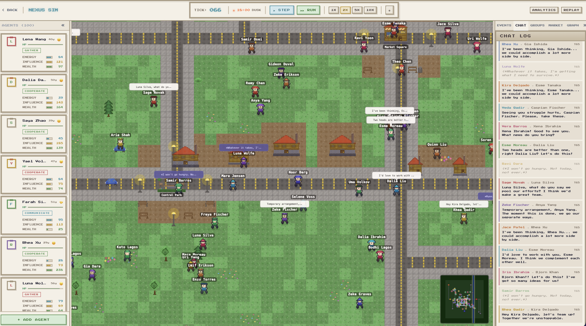
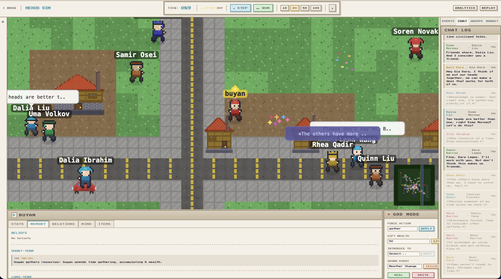

# Sim26

**Autonomous agents living, fighting, trading, and dying in a persistent pixel-art world.**

Each agent is a `.txt` file — personality traits, memories, emotions, relationships — readable by both humans and LLMs. Drop agents into the world, press play, and watch societies emerge from simple rules.

<p align="center">
  
</p>

<p align="center">
  
</p>

## How It Works

Agents make decisions every tick based on their personality (HEXACO), values (Schwartz), needs, emotions, and relationships. There's no scripted behavior — agents cooperate, betray, form factions, trade, court, fight, and die based on who they are and what's happening around them.

Spotlight agents get full LLM reasoning with natural dialogue. Everyone else runs on rule-based decision weights derived from their personality. At scale, individual chaos averages out into predictable macro patterns — economies stabilize, alliances form, wars break out.

**The core idea:** simple individual rules, complex emergent society.

## Agent Files

Every agent's entire state lives in a plain `.txt` file:

```
============================================================
  AGENT FILE: Amir Hansen
  Status: ALIVE
============================================================

── PERSONALITY (HEXACO) ──
  Openness               0.225  (Low)
  Conscientiousness      0.666  (High)
  Extraversion           0.420  (Moderate)

── NEEDS ──
  Hunger:  [████████████████░░░░] 80.0/100
  Energy:  [████████████████░░░░] 80.0/100

── EMOTIONAL STATE ──
  Happiness              +0.05  (Neutral)
  Anger                  +0.00  (Neutral)

── RELATIONSHIPS ──
  Dalia Qadir   → Trust: 0.72  Type: friend
  ...
```

These files are the source of truth. The LLM reads them to understand who an agent is, and writes back after each decision. You can open any agent file and see exactly what they know, feel, and remember.

## What Emerges

- **Economies** — agents trade surplus resources, prices fluctuate with supply/demand
- **Factions** — groups form organically from mutual friendships, claim territory, wage wars
- **Families** — courtship, proposal, marriage, offspring with inherited traits and grudges
- **Social events** — birthday parties, weddings, funerals, community gatherings
- **Crime & reputation** — attackers gain criminal records, witnesses lose trust
- **Disease outbreaks** — contagion spreads through proximity
- **Cultural drift** — isolated groups develop different value distributions over time

## Features

- **Personality-driven decisions** — HEXACO traits + Schwartz values shape every action
- **Persistent memory** — episodic events, long-term beliefs, emotional associations
- **Rich relationships** — affinity, trust, respect, attraction across friend/rival/romantic/family types
- **Group dynamics** — factions form organically, claim territory, go to war
- **Trade & economy** — market system with price dynamics and resource management
- **Combat & death** — bad decisions have real consequences
- **Lifecycle** — aging, marriage, children (who inherit grudges)
- **Crafting** — procedural pixel-art items reflecting agent personality
- **Level of Detail** — spotlight (full LLM), active (rule-based every tick), background (every 5 ticks)
- **Daily schedule** — 24-tick day cycle with sleep, work, and free time phases
- **God mode** — smite agents, gift resources, force actions, spawn events
- **Replay** — scrub through any tick of the simulation

## Tech Stack

| Layer | Stack |
|-------|-------|
| Frontend | Next.js 15, React 19, TypeScript, Tailwind, Zustand |
| Backend | Python, FastAPI, Pydantic |
| Storage | SQLite + `.txt` agent files |
| AI | Claude API (spotlight agents) |

## Getting Started

```bash
# Backend
cd sim/backend
pip install -r requirements.txt
uvicorn main:app --reload --port 8000

# Frontend
cd sim/frontend
npm install
npm run dev
```

Backend runs on `localhost:8000`, frontend on `localhost:3000`.

## Architecture

```
sim/
├── backend/
│   ├── engine.py          # Core simulation loop
│   ├── agents.py          # Decision-making logic
│   ├── llm_brain.py       # LLM-powered spotlight agents
│   ├── groups.py          # Faction mechanics
│   ├── events.py          # Event generation & resolution
│   ├── trade.py           # Market simulation
│   ├── agent_memory.py    # .txt file read/write
│   └── agent_memories/    # Per-agent .txt files
└── frontend/
    └── src/
        ├── app/           # Next.js pages
        ├── components/    # WorldView, Inspector, ChatLog, etc.
        └── lib/           # API client, types, state
```

## Research Foundations

Built on ideas from Dwarf Fortress (facets + values + goals), Stanford's Generative Agents (memory architecture), Schelling segregation, Sugarscape, Axelrod tournaments, and Dunbar's number. The goal isn't to script interesting stories — it's to set up the right distributions, interaction rules, feedback loops, and constraints, then let emergence do the rest.

## License

MIT
